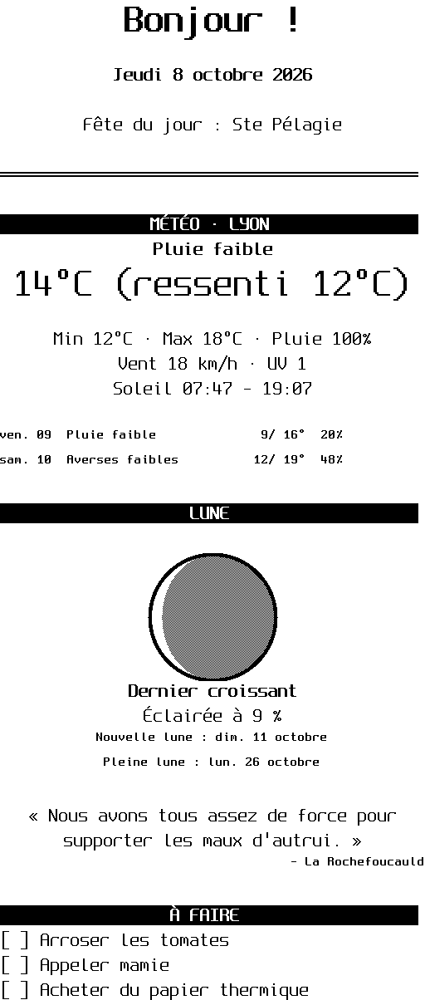
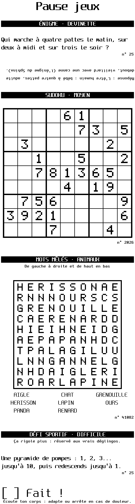
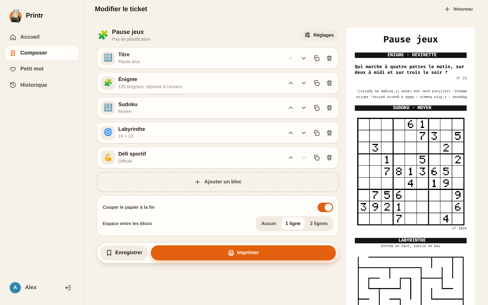
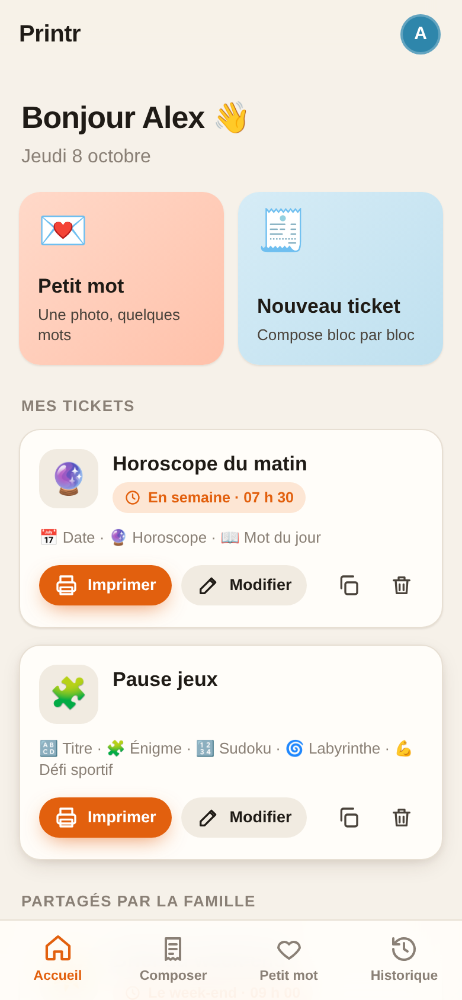
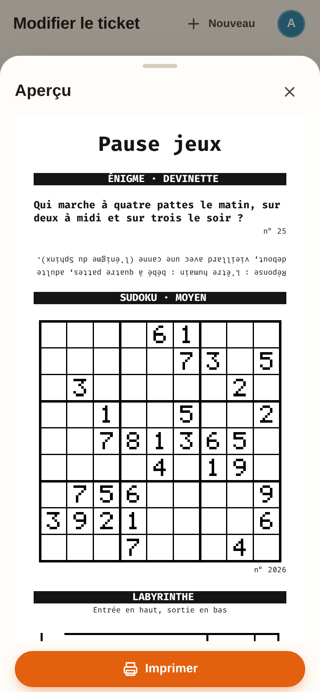
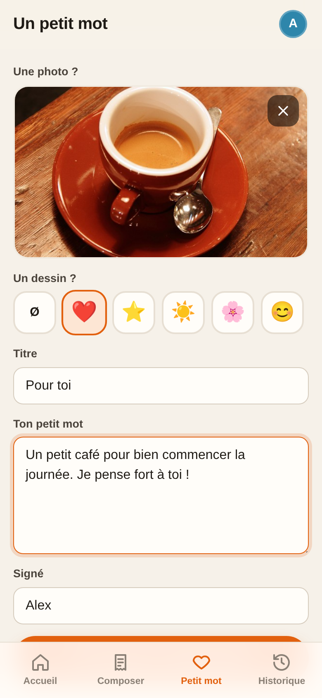

<p align="center">
  <picture>
    <source media="(prefers-color-scheme: dark)" srcset="docs/logo-dark.png">
    
  </picture>
</p>

<p align="center"><strong>Des petits tickets qui font du bien, tous les matins.</strong></p>

<p align="center">
  <a href="https://xninety9.github.io/Printr/"></a>
  
  
  
</p>

<p align="center">
  <a href="https://xninety9.github.io/Printr/">Site</a> ·
  <a href="#tickets-json">Les blocs</a> ·
  <a href="#interface-web">L'appli</a> ·
  <a href="#installation-sur-le-pi">Installer</a>
</p>

Printr transforme une imprimante à tickets **Epson TM-T88V** en gadget familial. On compose un
ticket à partir de **30 blocs** (météo, horoscope, sudoku, énigmes, actualités, photos…), on
l'imprime depuis son téléphone, on le **planifie** pour 7 h 30 en semaine, ou on envoie un
**petit mot avec une photo** à ceux qui sont restés à la maison. Un seul binaire Rust, sur un
Raspberry Pi, qui parle ESC/POS directement à l'imprimante.

<p align="center">
  
  &nbsp;
  
  &nbsp;
  
</p>

- **30 blocs** : météo, lune, saint du jour, jours fériés, horoscope (sérieux, farfelu, vachard
  ou franchement insultant), mot du jour, sudoku, labyrinthe, énigmes à réponse imprimée à
  l'envers, défi sportif, actualités par flux RSS, QR codes, pictogrammes, photos…
- **Une appli web pour la famille** : comptes, tickets enregistrés et partagés, aperçu en direct,
  planification au format 24 h, historique.
- **Sobre** : presque tout est calculé localement ou vient d'API gratuites et sans clé. Claude
  n'écrit que l'horoscope et le mot du jour (un petit appel à Claude Haiku, en cache pour la
  journée).
- **Une CLI soignée** : aperçu dans le terminal, progression bloc par bloc, erreurs lisibles.

<p align="center">
  <picture>
    <source media="(prefers-color-scheme: dark)" srcset="docs/shots/desktop-compose-dark.png">
    
  </picture>
</p>

## Démarrage rapide

```sh
cargo run --release -- --preview print examples/complet.json   # aperçu dans le terminal, sans imprimante
cargo run --release -- user add Camille                        # un compte pour l'interface web
cargo run --release -- --device /dev/usb/lp0 serve             # interface sur http://localhost:8080
```

Pas encore d'imprimante ? `scripts/demo.sh` imprime le ticket complet dans un
[émulateur](#tester-sans-imprimante-émulateur) et en donne une image PNG.

## L'horoscope, en quatre tons

Rédigé chaque jour par Claude, sur un thème tiré au hasard. Extraits authentiques :

| Ton | Signe | Extrait |
| --- | --- | --- |
| `serieux` | Scorpion | « Une conversation franche dissipera un malentendu qui pesait depuis plusieurs jours. » |
| `farfelu` | Gémeaux | « Un pigeon particulièrement élégant pourrait vous saluer d'un hochement de tête : rendez-lui la politesse, il est très influent dans le quartier. » |
| `vachard` | Vierge | « Votre partenaire rêve d'un dîner romantique. Rien de plus sensuel qu'une balance de cuisine posée entre deux bougies. » |
| `insultant` | Lion | « Tes baskets neuves, encore raides comme un notaire, se demandent ce qu'elles ont fait au bon Dieu pour tomber sur une feignasse pareille. » |

## Utilisation

```sh
printr print examples/matin.json    # ticket composé de blocs (voir plus bas)
cat ticket.json | printr print      # idem, depuis l'entrée standard
printr --preview print ticket.json  # aperçu dans le terminal, sans imprimer
printr --refresh print ticket.json  # régénère ce qui est en cache : soleil, horoscopes, mot du jour
printr -q print ticket.json         # silencieux, n'affiche que les erreurs
printr test                         # ticket de test (styles, accents, QR code)
printr text "Salut !"               # texte libre, puis coupe
echo "depuis stdin" | printr text   # lit l'entrée standard
printr text --no-cut "sans coupe"
printr image photo.jpg             # image réduite à 512 px, tramée (Floyd–Steinberg)
printr image --no-dither logo.png   # simple seuil noir/blanc, pour logos et dessins au trait
```

Destination, au choix :

| Option | Destination |
| --- | --- |
| `--device <chemin>` | imprimante USB (défaut `/dev/usb/lp0`, ou `$PRINTR_DEVICE`) |
| `--tcp hôte:port` | imprimante réseau ou émulateur |
| `--dump <fichier>` | écrit les octets ESC/POS bruts dans un fichier |

## Tickets JSON

Un ticket est une liste de blocs. Les blocs sont construits en parallèle (requêtes réseau
comprises) et leur résultat s'affiche dans la CLI dès que chacun est prêt ; le ticket est ensuite
imprimé dans l'ordre défini. Un bloc en échec imprime un message au lieu de bloquer le ticket.
Un paramètre inconnu est une erreur, pour repérer les fautes de frappe.

```json
{
  "cut": true,
  "spacing": 1,
  "blocks": [
    { "type": "title", "text": "Bonjour !" },
    { "type": "weather", "location": "Lyon", "days": 3 },
    { "type": "horoscope", "sign": "scorpion", "tone": "farfelu" }
  ]
}
```

| Bloc | Paramètres (défaut) | Notes |
| --- | --- | --- |
| `title` | `text`, `size` (2) | Gras, centré, agrandi |
| `text` | `text`, `bold`, `underline`, `reverse`, `small`, `size` (1), `align` (`left`/`center`/`right`) | Coupé aux mots |
| `separator` | `style` (`-`) | Un caractère répété : `-`, `=`, `═`, `─`, `·`… |
| `date` | — | « Mercredi 7 octobre 2026 » |
| `feed` | `lines` (1) | Espace vertical |
| `image` | `path` ou `url`, `dither` (true) | Réduite à 512 px |
| `qr` | `data`, `size` (6), `caption` | |
| `weather` | `location`, `days` (1, max 7) | [Open-Meteo](https://open-meteo.com), sans clé. `location` : ville ou `"lat,lon"` |
| `barnum` | `sign` ou `birth_date` (`AAAA-MM-JJ`), `sky` (false), `variant` | Horoscope hors ligne et gratuit, calculé sur le vrai ciel par [Barnum](https://github.com/XNinety9/Barnum) : jauges par domaine, conseil, et en option la position des planètes |
| `horoscope` | `sign`, `tone` (`serieux`/`farfelu`/`vachard`/`insultant`) | Généré par Claude, sur un thème tiré au hasard. Signe en français ou en anglais |
| `saint` | — | Calendrier local, hors ligne |
| `todo` | `items`, `title` (« À faire ») | Cases à cocher |
| `sudoku` | `difficulty` (`facile`/`moyen`/`difficile`), `seed`, `solution` | Le n° imprimé est la graine : même `seed` + `"solution": true` imprime la solution |
| `maze` | `width` (12), `height` (16), `seed` | |
| `word_of_the_day` | — | Choisi par Claude, sans répéter les 60 derniers mots |
| `quote` | — | Citation du jour, liste locale |
| `holidays` | `zone` (`metropole`/`alsace-moselle`), `count` (1) | Calcul local, vérifié contre calendrier.api.gouv.fr |
| `countdown` | `label`, `date` (`AAAA-MM-JJ`) | « J-79 avant : Noël » |
| `moon` | — | Phase, illumination, prochaines pleine et nouvelle lunes. Calcul local |
| `on_this_day` | `count` (3) | Éphéméride, Wikipédia en français |
| `air_quality` | `location` | Indice européen, particules, pollens (Open-Meteo) |
| `crypto` | `coins` (`["bitcoin", "ethereum"]`, identifiants CoinGecko), `currency` (`eur`) | Cours et variation sur 24 h |
| `sun` | `location` | Lever, coucher et durée du jour via Open-Meteo, sans clé |
| `riddle` (ou `enigme`) | `kind` (`devinette`/`charade`/`logique`/`calcul`), `number`, `answer` (`envers`/`lendemain`/`dessous`/`aucune`) | 125 énigmes, une par jour sans répétition. Par défaut, la réponse est imprimée à l'envers : on retourne le ticket pour la lire |
| `workout` (ou `defi_sportif`) | `level` (`facile`/`moyen`/`difficile`), `number` | Défi sportif du jour, sans équipement, 25 défis par niveau |
| `news` | `title`, `feeds` (URL RSS/Atom), `count` (3, max 5), `qr` (2, max 2), `themes`, `exclude`, `max_age_hours` (24) | Revue de presse sans IA : voir ci-dessous |

### Actualités (`news`)

Le bloc lit les flux RSS ou Atom fournis, sans IA, gratuitement et en moins d'une seconde.
Les articles sont classés selon :

- les **thèmes** demandés : trouvés dans le titre (le plus fort), la rubrique de l'URL ou les
  catégories, ou le chapô. Un thème se cherche en début de mot (« climat » trouve « climatique ») ;
- leur **place dans le flux** (la une de la rédaction d'abord) ;
- les **recoupements** : un sujet traité par plusieurs flux remonte ;
- leur **fraîcheur** (au-delà de `max_age_hours`, l'article est écarté).

Les directs, vidéos, podcasts et tribunes sont écartés, ainsi que les articles contenant un mot
de `exclude`. Deux articles sur le même sujet ne sont jamais retenus ensemble. Les `qr` premiers
reçoivent un QR code, deux par ligne. `PRINTR_DEBUG=1` affiche le classement complet.

```json
{ "type": "news", "title": "France",
  "feeds": ["https://www.franceinfo.fr/titres.rss", "https://www.lemonde.fr/rss/une.xml"],
  "themes": ["climat", "sciences", "santé"], "exclude": ["football"] }
```

Le bloc `barnum` appelle [Barnum](https://github.com/XNinety9/Barnum) en ligne de commande :
`barnum` s'il est installé, sinon la commande donnée dans `PRINTR_BARNUM`, par exemple
`PRINTR_BARNUM="python3 /opt/barnum/main.py"` (Barnum ne dépend que de Python 3.10).

De temps en temps (une impression sur 20), la machine glisse dans le ticket un message étrange,
sans en-tête, comme du bruit imprimé : c'est le **glitch**. `PRINTR_GLITCH` règle la fréquence
(`PRINTR_GLITCH=5` pour une sur cinq, `0` pour jamais) ; `{ "type": "glitch" }` en force un.
Il n'apparaît jamais dans les aperçus.

Les blocs `horoscope` et `word_of_the_day` utilisent l'API Claude : définir `ANTHROPIC_API_KEY`
(et optionnellement `PRINTR_CLAUDE_MODEL`, `claude-haiku-5-5` par défaut).

Les contenus dépendant d'une date sont **mis en cache** : réimprimer le même ticket redonne les
mêmes résultats, sans nouvel appel. `--refresh` force une nouvelle génération. Le cache vit dans
`~/.cache/printr` (ou `$PRINTR_CACHE_DIR`, ou `/var/cache/printr` avec le service systemd).
`PRINTR_DEBUG=1` affiche les réponses brutes de l'API.

## Interface web

`printr serve` sert une interface web pensée pour le téléphone comme pour l'ordinateur :

<p align="center">
  
  &nbsp;
  
  &nbsp;
  
</p>

- **Composer** : ajouter, régler et réordonner des blocs, avec l'aperçu du ticket en direct.
  Les blocs Claude (horoscope, mot du jour) n'appellent pas l'API en aperçu : ils ne coûtent
  qu'à l'impression.
- **Mes tickets** : les tickets enregistrés (presets), à imprimer en un geste, à partager avec
  la famille et à **planifier** (jours et heure). Une échéance manquée de plus de 15 minutes
  n'est pas rattrapée.
- **Petit mot** : une photo prise avec le téléphone, un dessin (cœur, étoile…), quelques mots.
- **Historique** : qui a imprimé quoi, et les éventuelles erreurs.

Chaque membre de la famille a son compte :

```sh
printr user add Camille       # demande le mot de passe (ou le lit sur l'entrée standard)
printr user passwd Camille
printr user remove Camille
printr user list
```

Les données (comptes, presets, historique, photos) vivent dans `$PRINTR_DATA_DIR`, sinon
`~/.local/share/printr`, ou `/var/lib/printr` avec le service systemd. Pour travailler sur
l'interface sans recompiler : `PRINTR_WEB_DIR=web printr serve`.

## Serveur HTTP

```sh
printr serve --listen 0.0.0.0:8080 --token $(openssl rand -hex 24)   # jeton : optionnel
```

| Route | Corps | Effet |
| --- | --- | --- |
| `GET /` | — | Vérifie que le serveur tourne |
| `POST /print` | Un ticket JSON | Imprime le ticket |
| `POST /todo` | `{"title"?, "items"?: [...], "text"?: "une\nligne\npar\nélément"}` | Imprime la date et une liste à cocher |

Pour les scripts, les `POST` exigent l'en-tête `Authorization: Bearer <jeton>` (défini avec `--token`). Ajouter `?preview` renvoie
l'aperçu texte sans imprimer. La réponse est `{"ok": true, "errors": [...]}`, où `errors` liste
les blocs en échec. Les requêtes sont traitées une par une : deux impressions ne se mélangent jamais.

```sh
curl -X POST http://raspberrypi:8080/print -H "Authorization: Bearer $PRINTR_TOKEN" \
     --data @examples/matin.json
```

### Imprimer ses Rappels iOS

Apple ne propose pas d'API pour Rappels, mais l'app Raccourcis peut envoyer la liste au Pi.
Dans un nouveau raccourci :

1. **Rechercher des rappels** : filtre « Liste est *Courses* » et « N'est pas terminé ».
2. **Combiner le texte** : entrée = les rappels, séparateur = « Nouvelle ligne ».
3. **Obtenir le contenu de l'URL** :
   - URL : `http://<ip-du-pi>:8080/todo`, méthode **POST** ;
   - en-tête `Authorization` = `Bearer <jeton>` ;
   - corps **JSON** : `title` (texte) = `Courses`, `text` (texte) = *Texte combiné*.
4. Optionnel : **Afficher la notification** avec le résultat.

Pour l'automatiser : Raccourcis > Automatisation > Heure de la journée, puis « Exécuter
immédiatement ». Le téléphone doit pouvoir joindre le Pi (même Wi-Fi, ou un VPN type Tailscale).

## Tester sans imprimante (émulateur)

[emupos](https://pypi.org/project/emupos/) simule l'imprimante et rend chaque ticket en PNG + texte.
Le dossier `emulator/` contient un profil TM-T88V (512 points, 180 dpi).

Pour générer le ticket complet (tous les blocs) en une commande :

```sh
scripts/demo.sh                          # examples/complet.json par défaut
scripts/demo.sh examples/extras.json     # ou n'importe quel ticket
# → affiche le chemin du rendu, emulator/receipts/<id>.png (et .txt)
```

Le script lance l'émulateur, imprime le ticket, attend le rendu puis arrête l'émulateur.
Les blocs Claude demandent `ANTHROPIC_API_KEY` dans l'environnement.

À la main, dans deux terminaux :

```sh
cd emulator && uvx emupos run                # terminal 1
cargo run -- --tcp 127.0.0.1:9100 test       # terminal 2
# → emulator/receipts/*.png et *.txt
```

## Site et illustrations

Le site vitrine vit dans [`docs/`](docs/) (GitHub Pages, branche `master`, dossier `/docs`).
Ses illustrations sont générées avec des données fictives uniquement :

```sh
docs/demo/photo-session.sh                              # captures de l'appli + tickets de l'émulateur
uv run --with pillow python docs/brand/make-assets.py   # déclinaisons du logo et icônes de l'appli
```

## Compiler pour le Raspberry Pi

Avec [`cross`](https://github.com/cross-rs/cross) (nécessite Docker) :

```sh
cross build --release --target aarch64-unknown-linux-gnu    # Pi 3 / Zero 2 W, OS 64 bits
cross build --release --target arm-unknown-linux-gnueabihf  # Pi Zero W (ARMv6)
scp target/aarch64-unknown-linux-gnu/release/printr pi@raspberrypi:
```

## Installation sur le Pi

L'imprimante est exposée par le module noyau `usblp` en `/dev/usb/lp0`.
Pour y accéder sans `sudo` :

```sh
sudo cp deploy/70-tm-t88v.rules /etc/udev/rules.d/
sudo udevadm control --reload && sudo udevadm trigger
sudo usermod -aG lp $USER   # puis se reconnecter
```

La règle crée aussi le lien stable `/dev/tm88` : `printr --device /dev/tm88 test`.

Pour lancer le serveur au démarrage, voir [deploy/printr.service](deploy/printr.service)
et [deploy/printr.env.example](deploy/printr.env.example) (jeton, clé API, périphérique).
